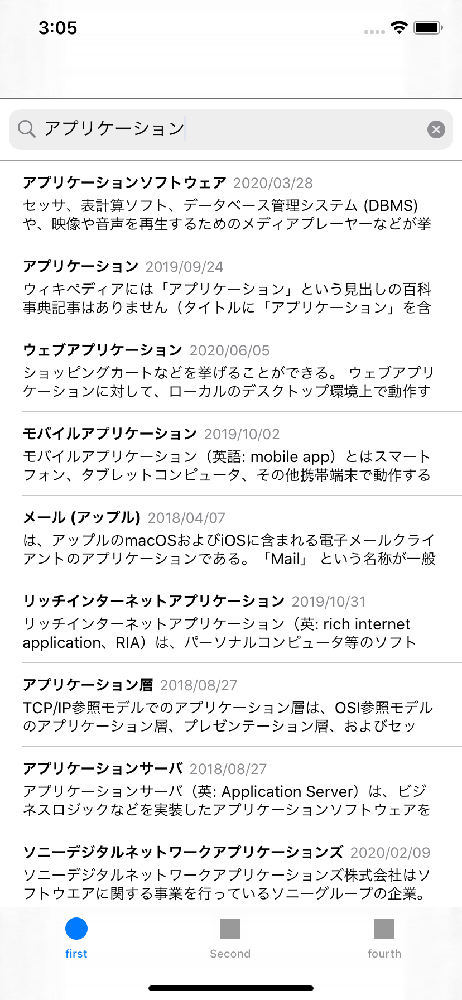
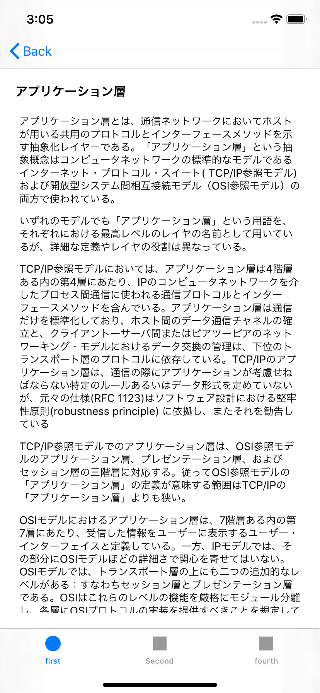

# RxSwiftIncrementalSearch

RxSwiftでインクリメンタルサーチ＆ページネーションのサンプル

## 実行した環境
- Xcode 13.1
- Swift 5.5.1
- macOS Catalina 11.6

## 主に使用しているライブラリ
- CocoaPod 1.11.2
- Carthage 0.38.0
- Mint 0.17.1
- APIKit 5.2.0
- RxSwift 6.2.0

## キャプチャ

|  一覧  |  詳細  |
| ---- | ---- |
|  |  |

## スクリプト
以下のスクリプトで、必要な環境を構築します。
` ./scripts/bootstrap.sh`

## コマンド
以下のコマンドをMakefileに登録してるので、必要に応じて使ってください。
mintでインストールしているライブラリの更新

`$ make mint-bootstrap`

Carthageのライブラリの更新

`$ make carthage-bootstrap`

Cocoapodのライブラリを更新する場合は、以下のコマンド

`$ bundle install pod install`
